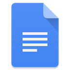
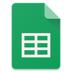

## New Zealand Atlanta Association Website - 2017

An experiment at implementing website based on a stack consisting of:

**Google Docs - Google Sheets - Firebase - jQuery...**

**.... a surprisingy powerful stack on the cheap with a Rich Text Editor, CMS Publishing platform, Realtime Database and Mature Front End Framework for a variety of use cases. Google-Query stack maybe?**.

### [Live example: NZAA website (TODO)]()

## Get Started

This Repo will only get you the 'front end' of the project-

1. Clone the repo `git clone https://github.com/airbr/nzaa`
2. Change into the public directory and install dependencies with npm `cd public && npm install`

To get the full stack working if you wish to refactor this project it is necessary to :

* Have a Google Account which will give you access to Google Drive, Google Sheets, Firebase
* Create a Firebase project via the online console
* Configure and deploy your project via Firebase Command Line Tools
* Configure your Google Drive CMS with your Firebase Project's Database
* Link your Google Doc correctly with Google Drive CMS, to use it as a rich text editor (optional)

Ultimately, though, you will find it satisfying publishing to your website with the click of a button from a google sheet. Especially if you are able to configure it for someone else, so they don't need your help !

## Development

#####[The Trello for this project is at this link, I intend to properly Kanban my progress. I have approached this project as an attempt to learn and document my experiences using these free services a long with a number of scripts/resources I have come across peculiar to Google services](https://trello.com/b/RTwTGDnO/nzaa-development)

#### Background:

This project is based on a need to help revamp the website for a local civic association, [the New Zealand Atlanta Association](http://www.atlantanz.org). I identify the need to keep the website very simple while significantly improving on its current form. The website also needs some very basic CMS capability that someone of basic technical capability could manage. Also, it should be free! (also, see my my early Express/Node Project that I deemed actually, ultimately, over the top for the needs of the organization: [https://github.com/airbr nzaa-dev](https://github.com/airbr nzaa-dev).

## Technologies / h/t

[Google Drive CMS](https://www.drivecms.xyz/)

